# Cayley Dickson
*Author*: [Travis Hoppe](http://thoppe.github.io/)

Implementation of the [Cayley-Dickson](http://en.wikipedia.org/wiki/Cayley%E2%80%93Dickson_construction) process in python. 
Requires [`pandas`](http://pandas.pydata.org/) and [`numpy`](http://www.numpy.org/) to create the multiplication tables and [`seaborn`](http://stanford.edu/~mwaskom/software/seaborn/), [`networkx`](https://networkx.github.io/), and [`graph-tool`](https://graph-tool.skewed.de/) to display.

#### Algebras names

While the lower order algebras (up to sedenions) have agreed upon names, the infrequent usage of the larger orders has led to an inconsistent Latin naming scheme. 
Suggested names for the higher orders come from this [Stack Exchange question](http://english.stackexchange.com/q/234607/17096). 
If two names are given, they are in order: the complete distributive form and the commonly known name.

#### Visualization

We can visualize the multiplication tables with a diverging colormap. 
Red values are positive, blue values are negative. 
For example, with the complex numbers `1 => least red`, `i => most red`, `-1 => least blue`, `-i => most blue`.
Additionally, for the smaller algebras, we can construct the [Cayley Graph](http://en.wikipedia.org/wiki/Cayley_graph).

### Complex numbers

A [complex number](http://en.wikipedia.org/wiki/Complex_number) is a number that can be expressed in the form `a + bi`, where `a` and `b` are real numbers and `i` is the imaginary unit. They are a normed division algebra over the real numbers. There is no natural linear ordering on the set of complex numbers.

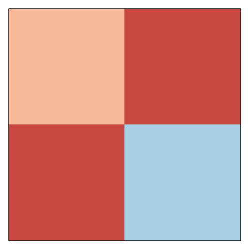
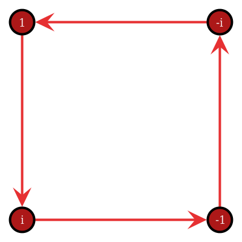

### Quaternions
[Quaternions](http://en.wikipedia.org/wiki/Quaternion) are a normed division algebra over the real numbers. They are noncommutative. The unit quaternions can be thought of as a choice of a group structure on the 3-sphere S3 that gives the group Spin(3), which is isomorphic to SU(2) and also to the universal cover of SO(3).

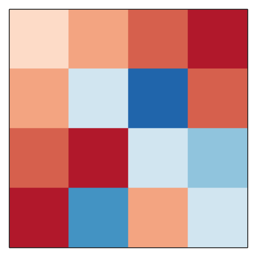
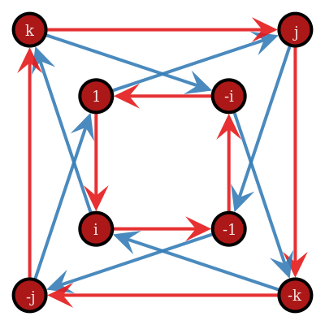

### Octonions

The [octonions](http://en.wikipedia.org/wiki/Octonion) are a normed division algebra over the real numbers. They are noncommutative and nonassociative, but satisfy a weaker form of associativity, namely they are alternative. The Cayley graph is hard project into two-dimensions, there overlapping edges along the diagonals.

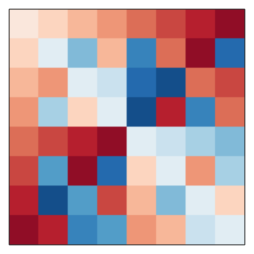
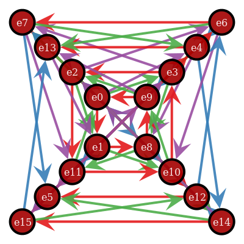

### Sedenions

The [sedenions](http://en.wikipedia.org/wiki/Sedenion) form a 16-dimensional noncommutative and nonassociative algebra over the reals obtained by applying the Cayley–Dickson construction to the octonions.

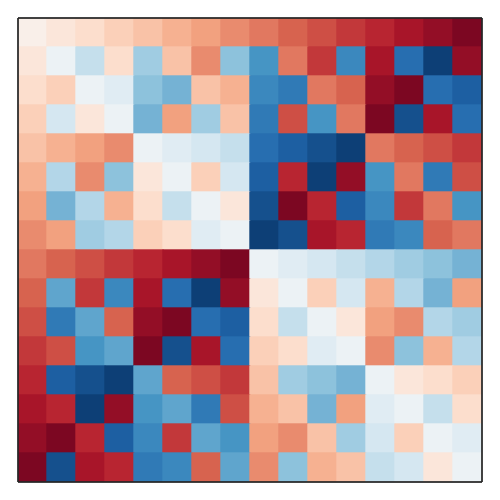

### Trigintaduonions/Tricenibinions (32ions)

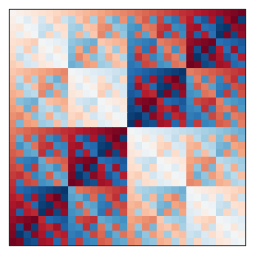

### Sexagintaquatronions/Sexageniquaternions (64ions)

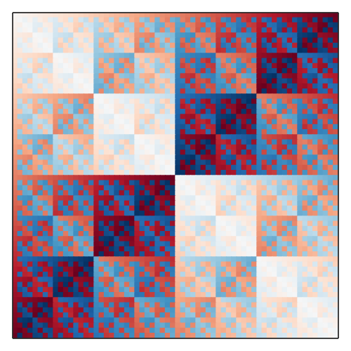

### Centumduodetrigintanions/Centeniduodetricenions (128ions)

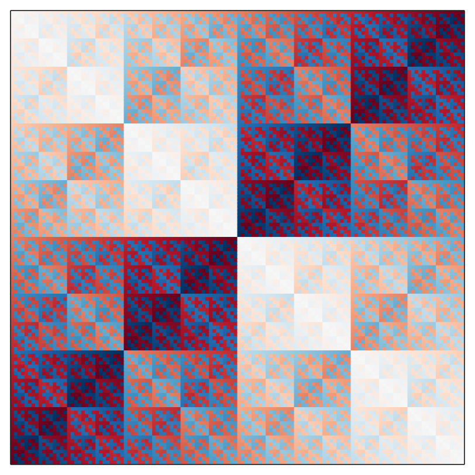

### Ducentiquinquagintasexions/Duceniquinquagenisenions (256ions)

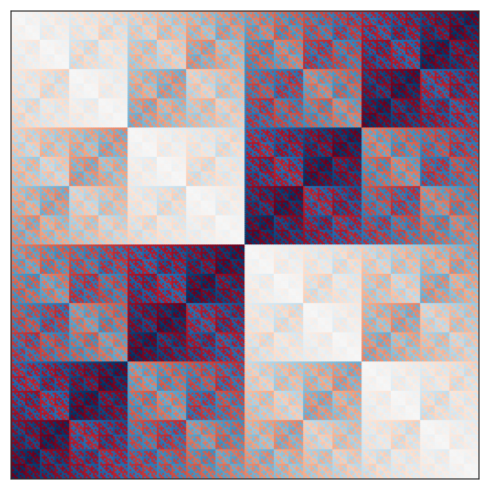

#### Quingeniduodenions (512-ion)

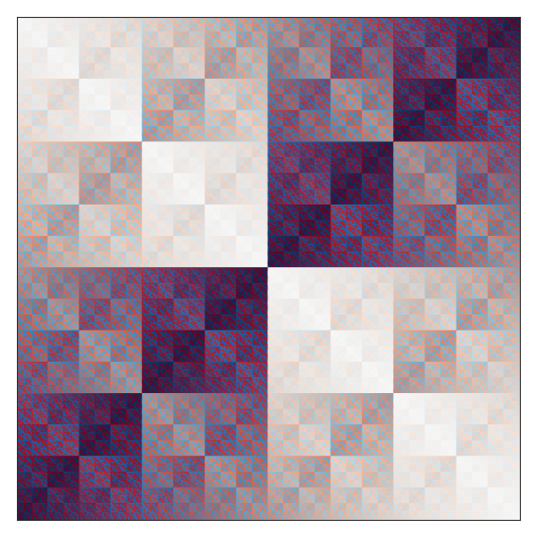

#### Miliaviceniquaternions (1024-ion)

#### Binamiliaduodequinquagenions (2048-ion)

#### Quaternamilianonagenisenions (4096-ion)

